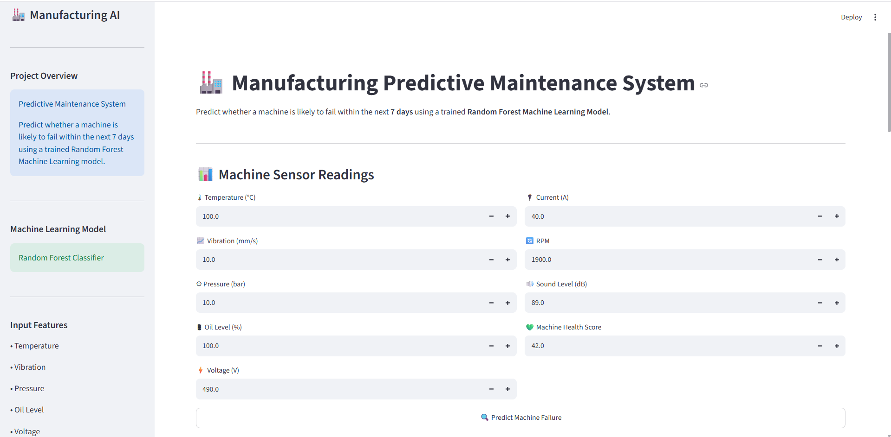

<h1 align="center">🏭 Manufacturing Quality Control & Predictive Maintenance</h1>

<p align="center">
An End-to-End Manufacturing Analytics, Machine Learning & Predictive Maintenance Solution
</p>

<p align="center">
  
  
  
  
  
</p>

---

# 📌 Project Overview

The **Manufacturing Quality Control & Predictive Maintenance** project is an end-to-end manufacturing analytics solution that combines **Quality Control Analysis** with **Machine Learning-based Predictive Maintenance**.

The project analyzes production quality, inspection results, machine performance, supplier performance, and sensor readings while predicting whether a machine is likely to fail within the next **7 days** using a **Random Forest Classifier**.

This solution helps manufacturing companies improve product quality, reduce unexpected machine failures, optimize maintenance schedules, and make data-driven operational decisions.

---

# 🎯 Business Problem

Unexpected machine failures can lead to:

- Production downtime
- Increased maintenance costs
- Delayed deliveries
- Equipment damage
- Reduced operational efficiency

This project enables maintenance teams to identify high-risk machines early using machine learning and sensor data.

---

# 🚀 Project Workflow

```text
Raw Manufacturing Data
          │
          ▼
Data Cleaning & Preprocessing
          │
          ▼
Exploratory Data Analysis
          │
          ▼
Machine Learning Model
          │
          ▼
Failure Prediction
          │
          ▼
Interactive Streamlit Dashboard
```

---

# 🚀 Features

## 📊 Quality Control Analytics

- Production Analysis
- Quality Inspection Analysis
- Machine Performance Monitoring
- Supplier Performance Analysis
- Sensor Data Analysis

## 🤖 Predictive Maintenance

- Random Forest Classifier
- Machine Failure Prediction
- Failure Probability
- Maintenance Recommendation
- Prediction Report Download (PDF & CSV)

---

# 📊 Input Features

The prediction model uses the following machine sensor readings:

- Temperature (°C)
- Vibration (mm/s)
- Pressure (bar)
- Oil Level (%)
- Voltage (V)
- Current (A)
- RPM
- Sound Level (dB)
- Machine Health Score

---

# 🧠 Machine Learning Model

**Algorithm Used**

- Random Forest Classifier

The trained model predicts whether a machine is likely to fail within the next **7 days** based on sensor readings.

---

# 📊 Model Performance Comparison

<p align="center">
  
</p>

| Model | Accuracy | Precision | Recall | F1-Score | ROC-AUC |
|--------|----------|-----------|---------|----------|----------|
| Logistic Regression | 99.1% | 95.7% | 71.1% | 81.6% | 96.9% |
| Decision Tree | 98.8% | 78.0% | 77.2% | 77.6% | 88.3% |
| **Random Forest** ✅ | **99.3%** | **97.9%** | **76.7%** | **86.0%** | **96.7%** |

### 🏆 Final Model Selection

After evaluating multiple machine learning algorithms, the **Random Forest Classifier** was selected because it achieved the best overall performance across Accuracy, Precision, F1-Score, and ROC-AUC, making it the most reliable model for predictive maintenance.

---

# 🖥 Dashboard Preview

## 🏠 Home Page

<p align="center">
  
</p>

---

## 📈 Prediction Result

<p align="center">
  
</p>

---

## 📋 Input Summary

<p align="center">
  
</p>

---

## 📄 Prediction Details

<p align="center">
  
</p>

---

# 📂 Project Structure

```text
Manufacturing-Quality-Control-Predictive-Maintenance/
│
├── Data/
│   ├── Raw_Data/
│   └── Cleaned_Data/
│
├── Images/
│   ├── home.png
│   ├── prediction_dashboard.png
│   ├── input_summary.png
│   ├── prediction_details.png
│   └── model_performance_comparison.png
│
├── Models/
│   ├── random_forest.pkl
│   └── scaler.pkl
│
├── Notebooks/
│   ├── 01_Data_Understanding.ipynb
│   ├── 02_Data_Cleaning.ipynb
│   ├── 03_Business_Analysis.ipynb
│   └── 04_Machine_Learning.ipynb
│
├── Reports/
│   └── Manufacturing_Project_Report.pdf
│
├── .gitignore
├── LICENSE
├── app.py
├── README.md
└── requirements.txt
```

---

# ⚙️ Installation

Clone the repository

```bash
git clone https://github.com/gunnugarg2004-svg12/Manufacturing-Quality-Control-Predictive-Maintenance.git
```

Move into the project directory

```bash
cd Manufacturing-Quality-Control-Predictive-Maintenance
```

Install dependencies

```bash
pip install -r requirements.txt
```

Run the Streamlit application

```bash
streamlit run app.py
```

---

# 📦 Technologies Used

- Python
- Pandas
- NumPy
- Matplotlib
- Plotly
- Scikit-learn
- Streamlit
- Joblib
- Git & GitHub

---

# 🎯 Key Skills Demonstrated

- Data Cleaning
- Exploratory Data Analysis (EDA)
- Feature Engineering
- Data Visualization
- Machine Learning
- Predictive Maintenance
- Classification Modeling
- Streamlit Application Development
- Business Analytics

---

# 💼 Business Value

This project helps manufacturing organizations:

- Reduce unexpected machine failures
- Improve maintenance planning
- Increase production efficiency
- Lower maintenance costs
- Improve equipment reliability
- Enable data-driven operational decisions

---

# 📈 Future Improvements

- Real-time IoT sensor integration
- Live machine monitoring
- Email alerts for high-risk machines
- Maintenance scheduling dashboard
- Cloud deployment with authentication

---

# 📈 Project Outcomes

- Improved manufacturing quality monitoring
- Early prediction of machine failures
- Reduced unexpected production downtime
- Data-driven maintenance planning
- Interactive Streamlit web application
- Business-focused manufacturing insights

---

# 👨‍💻 Developed By

## Annu Garg

**Aspiring Data Analyst | Machine Learning Enthusiast**

🔗 GitHub: https://github.com/gunnugarg2004-svg12

💼 LinkedIn: https://www.linkedin.com/in/annu-garg-0432a7402/

---

# 📜 License

This project is licensed under the **MIT License**.

See the [LICENSE](LICENSE) file for more details.

---

# ⭐ Support

If you found this project useful, please consider giving it a ⭐ on GitHub.

Thank you for visiting this repository!