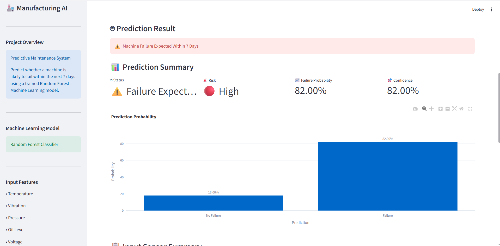
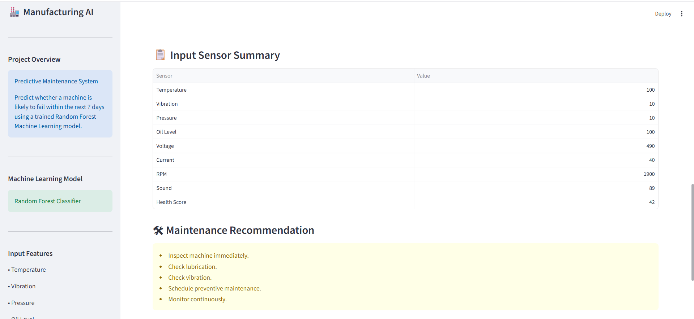
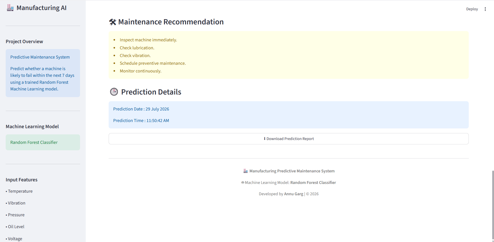

<h1 align="center">
🏭 Manufacturing Quality Control & Predictive Maintenance
</h1>

<p align="center">
End-to-End Manufacturing Analytics • Machine Learning • Predictive Maintenance
</p>

<p align="center">
  
  
  
  
  
</p>

---

## 📌 Project Overview

The **Manufacturing Quality Control & Predictive Maintenance** project is an end-to-end manufacturing analytics solution that combines **Quality Control Analysis** and **Machine Learning-based Predictive Maintenance**.

The project analyzes production quality, inspection results, machine performance, and sensor readings while predicting whether a machine is likely to fail within the next **7 days** using a Random Forest Classifier.

It helps manufacturing companies improve product quality, reduce unexpected downtime, optimize maintenance schedules, and make data-driven operational decisions.
---

# 🎯 Business Problem

Unexpected machine failures can lead to:

- Production downtime
- Increased maintenance costs
- Delayed deliveries
- Equipment damage
- Reduced operational efficiency

This project enables maintenance teams to identify high-risk machines early using machine learning and sensor data.

---

## 🚀 Features

### 📊 Quality Control Analytics

- Production Analysis
- Quality Inspection Analysis
- Machine Performance Monitoring
- Supplier Performance Analysis
- Sensor Data Analysis

### 🤖 Predictive Maintenance

- Random Forest Classifier
- Failure Prediction
- Failure Probability
- Maintenance Recommendation
- Prediction Report Download
---

# 📊 Input Features

The prediction model uses the following machine sensor readings:

- Temperature (°C)
- Vibration (mm/s)
- Pressure (bar)
- Oil Level (%)
- Voltage (V)
- Current (A)
- RPM
- Sound Level (dB)
- Machine Health Score

---

# 📊 Model Performance Comparison

The project evaluates multiple machine learning algorithms and selects the best-performing model based on classification metrics.

<p align="center">
  
</p>

### Performance Summary

| Model | Accuracy | Precision | Recall | F1-Score | ROC-AUC |
|-------|----------|-----------|--------|----------|---------|
| Logistic Regression | 99.1% | 95.7% | 71.1% | 81.6% | 96.9% |
| Decision Tree | 98.8% | 78.0% | 77.2% | 77.6% | 88.3% |
| **Random Forest** ✅ | **99.3%** | **97.9%** | **76.7%** | **86.0%** | **96.7%** |

### 🏆 Final Model Selection

After evaluating multiple algorithms, the **Random Forest Classifier** was selected because it achieved the best overall performance, offering the highest Accuracy, Precision, and F1-Score while maintaining excellent ROC-AUC. This makes it the most reliable model for predicting machine failures within the next 7 days.

---

# 🧠 Machine Learning Model

- Random Forest Classifier

The model predicts whether a machine is likely to fail within the next **7 days**.

---

# 🖥 Dashboard Preview

## Home Screen


```

```

---

## Prediction Result



```

```

---

## Input Summary 



```

```

---

## Prediction Details



```

```

---

# 📂 Project Structure

```
Manufacturing-Quality-Control-Predictive-Maintenance/
│
├── Data/
│   ├── Raw_data/
│   └── Cleaned_Data/
│
├── Images/
│   ├── home.png
│   ├── prediction_dashboard.png
│   ├── input_summary.png
│   └── prediction_details.png
│
├── Models/
│   ├── random_forest.pkl
│   └── scaler.pkl
│
├── Notebooks/
│   ├── 01_Data_Understanding.ipynb
│   ├── 02_Data_Cleaning.ipynb
│   ├── 03_Business_Analysis.ipynb
│   └── 04_Machine_Learning.ipynb
│
├── Reports/
│   └── Manufacturing_Project_Report.pdf
│
├── .gitignore
├── LICENSE
├── app.py
├── README.md
└── requirements.txt

```
---

# ⚙ Installation

Clone the repository

```bash
git clone https://github.com/gunnugarg2004-svg12/manufacturing-predictive-maintenance.git
```

Move into the project directory

```bash
cd manufacturing-predictive-maintenance
```

Install the required packages

```bash
pip install -r requirements.txt
```

Run the Streamlit application

```bash
streamlit run app.py
```

---

# 📦 Technologies Used

- Python
- Pandas
- Scikit-learn
- Streamlit
- Plotly
- Joblib

---

# 📈 Future Improvements

- Real-time IoT sensor integration
- Live machine monitoring
- Email alerts for high-risk machines
- Maintenance scheduling dashboard
- Cloud deployment with authentication

---

# 👨‍💻 Developed By

**Annu Garg**

Aspiring Data Analyst | Machine Learning Enthusiast

GitHub: https://github.com/gunnugarg2004-svg12

LinkedIn: https://www.linkedin.com/in/annu-garg-0432a7402/

---

# ⭐ Support

If you found this project useful, consider giving it a ⭐ on GitHub.

---

# 📈 Project Outcomes

This project demonstrates the practical implementation of **Business Analytics**, **Machine Learning**, and **Streamlit** in a real-world manufacturing environment.

### Key Outcomes

- Improved manufacturing quality monitoring
- Early prediction of machine failures
- Reduced unexpected production downtime
- Data-driven maintenance planning
- Interactive web application for real-time predictions
- Business-focused insights for manufacturing operations

---

# 📜 License

This project is licensed under the **MIT License**.

Feel free to use, modify, and share this project for learning and educational purposes.
---